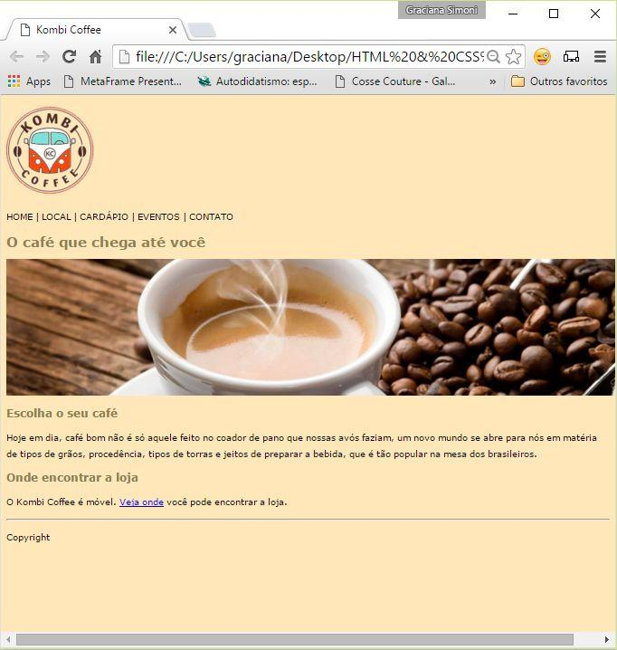

Você deverá estruturar o layout abaixo (o print está um pouco distorcido para caber todo o conteúdo) com as tags de estrutura básica do HTML, conforme as instruções. Os arquivos de imagens e o texto que estão no arquivo ZIP.

Você poderá utilizar a ferramenta Notepad++, Sublime ou Adobe Dreamweaver (neste caso deverá usar a interface no modo “Code”).  No caso do Notepad++, configure seu documento para “Encode UTF-8” no menu: “Encoding -> Convert to UTF-8” ou em português: “Codificação -> Converter para UTF-8” para não ter problemas com a codificação de caracteres especiais.

Em primeiro lugar, salve seu documento com o nome de “TP1_Seunome.html”. Em seguida estruture o conteúdo do documento de acordo com as seguintes recomendações:

    O documento deve utilizar a estrutura básica do HTML 5.
    Os títulos devem utilizar as tags acordo com a sua ordem de importância no documento.
    Os parágrafos devem estar em tags de parágrafo.
    Insira as imagens, não esquecendo de configurar os atributos de acessibilidade.
    Configure um link em “Veja onde” como https://www.google.com.br/maps, definindo também o atributo title.
    Utilizando o atributo STYLE, mude a cor de fundo e dos títulos do documento. Formate a aparência livremente, definindo cores, fonte do documento na tag BODY, mudando o tamanho dos textos (títulos e parágrafos), mas sempre com o uso do STYLE.
    Envie o documento no formato HTML nesta tarefa.
